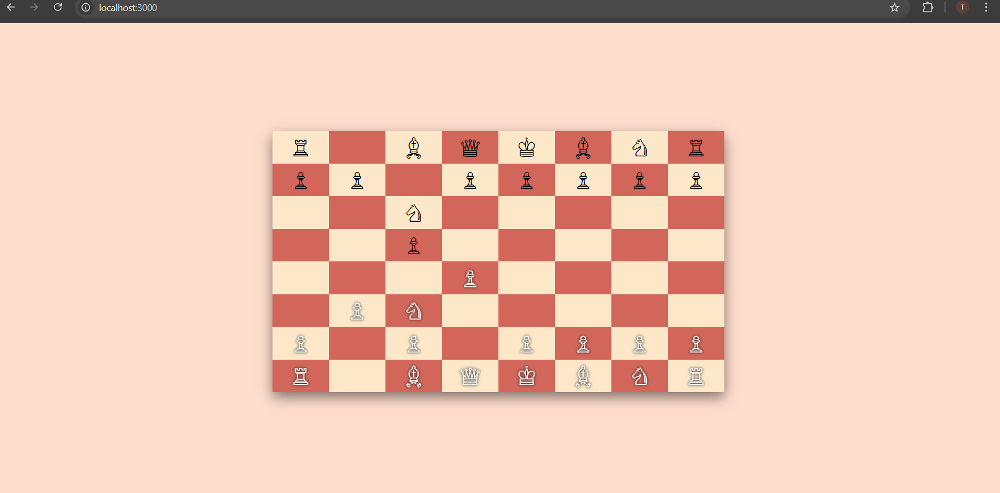

# Chess-Game

## Table of Contents
- [Introduction](#introduction)
- [Features](#features)
- [Technologies Used](#technologies-used)
- [Installation](#installation)
- [Usage](#usage)
- [Screenshots](#screenshots)
- [Contributing](#contributing)
- [License](#license)
- [Contact](#contact)

## Introduction
Welcome to the Chess-Game! This repository contains a multiplayer chess game implemented using Node.js, Socket.io, Chess.js, Bootstrap, CSS, and EJS. This game allows you to play chess in real-time with another player.

## Features
- Real-time multiplayer chess game
- Move validation using Chess.js
- Interactive and responsive UI with Bootstrap
- Real-time communication using Socket.io
- Easy-to-read and maintain codebase

## Technologies Used
- **Node.js**: For the server-side logic and handling HTTP requests.
- **Socket.io**: For real-time bidirectional event-based communication.
- **Chess.js**: For chess move generation/validation, piece placement/movement, and game state management.
- **Bootstrap**: For responsive and interactive UI components.
- **CSS**: For custom styling.
- **EJS**: For templating and rendering dynamic HTML.

## Installation
To install and run the Chess-Game locally, follow these steps:

1. Clone the repository:
    ```sh
    git clone https://github.com/tarunchauhan707/Chess-Game.git
    cd Chess-Game
    ```

2. Install the required dependencies:
    ```sh
    npm install
    ```

3. Start the server:
    ```sh
    npm start
    ```

    ```sh
       npm run dev   
    ```
## Usage
To start the game, open your browser and navigate to:
  ```sh
   http://localhost:3000
  ```
## Screenshots

*In-Game Screenshot*

## Contributing
Contributions are welcome! If you'd like to contribute, please follow these steps:

1. Fork the repository.
2. Create a new branch (`git checkout -b feature/YourFeature`).
3. Make your changes.
4. Commit your changes (`git commit -m 'Add some feature'`).
5. Push to the branch (`git push origin feature/YourFeature`).
6. Open a pull request.

## License
This project is licensed under the MIT License. See the [LICENSE](LICENSE) file for details.

## Contact
If you have any questions or feedback, feel free to reach out:
- GitHub: [tarunchauhan707](https://github.com/tarunchauhan707)
